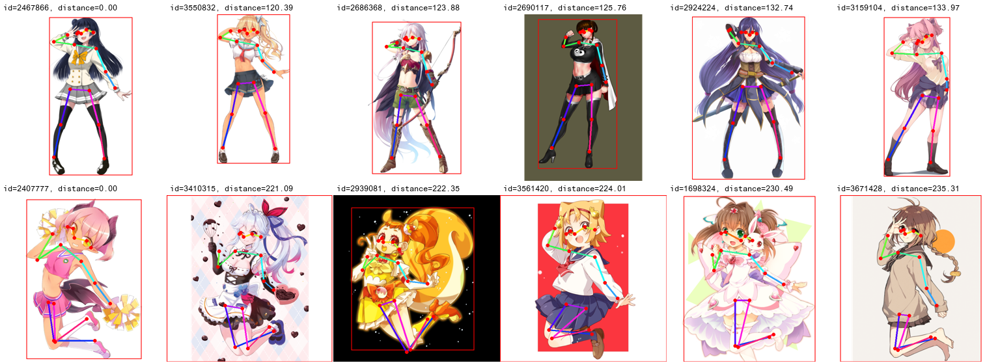

# bizarre-pose-estimator

**Transfer Learning for Pose Estimation of Illustrated Characters**  
Shuhong Chen[\*](https://shuhongchen.github.io/), Matthias Zwicker[\*](https://www.cs.umd.edu/~zwicker/)  
WACV2022  
\[[arxiv](https://arxiv.org/abs/2108.01819)\]
\[[video](https://www.youtube.com/watch?v=hOSjbRwfJrs)\]
\[[poster](./wacv2022_poster.pdf)\]
\[[github](https://github.com/ShuhongChen/bizarre-pose-estimator)\]  

_Human pose information is a critical component in many downstream image processing tasks, such as activity recognition and motion tracking. Likewise, a pose estimator for the illustrated character domain would provide a valuable prior for assistive content creation tasks, such as reference pose retrieval and automatic character animation. But while modern data-driven techniques have substantially improved pose estimation performance on natural images, little work has been done for illustrations. In our work, we bridge this domain gap by efficiently transfer-learning from both domain-specific and task-specific source models. Additionally, we upgrade and expand an existing illustrated pose estimation dataset, and introduce two new datasets for classification and segmentation subtasks. We then apply the resultant state-of-the-art character pose estimator to solve the novel task of pose-guided illustration retrieval. All data, models, and code will be made publicly available._

## web demo

Thanks to [AK391](https://github.com/AK391), integrated into [Huggingface Spaces 🤗](https://huggingface.co/spaces) using [Gradio](https://github.com/gradio-app/gradio). Try it out 

## download

Downloads can be found in this drive folder: [wacv2022_bizarre_pose_estimator_release](https://drive.google.com/drive/folders/11bw47Vy-RPKjgd6yF0RzcXALvp7zB_wt?usp=sharing)

* Download `bizarre_pose_models.zip` and extract to the root project directory; the extracted file structure should merge with the ones in this repo.
* Download `bizarre_pose_dataset.zip` and extract to `./_data`.  The images and annotations should be at `./_data/bizarre_pose_dataset/raw`.
* Download `character_bg_seg_data.zip` and extract to `./_data`.  Under `./_data/character_bg_seg`, there are `bg` and `fg` folders.  All foregrounds come from danbooru, and are indexed by the provided csv. While some backgrounds come from danbooru, we use several from [jerryli27/pixiv_dataset](https://github.com/jerryli27/pixiv_dataset); these are somewhat [hard](https://github.com/Nandaka/PixivUtil2) to download, so we provide the raw pixiv images in the zip.
* Please refer to Gwern's [Danbooru dataset](https://www.gwern.net/Danbooru2020) to download danbooru images by ID.

Warning: While NSFW art was filtered out from these data by tag, it was not possible to manually inspect all the data for mislabeled safety ratings. Please use this data at your own risk.

## setup

Make a copy of `./_env/machine_config.bashrc.template` to `./_env/machine_config.bashrc`, and set `$PROJECT_DN` to the absolute path of this repository folder.  The other variables are optional.

This project requires docker with a GPU.  Run these lines from the project directory to pull the image and enter a container; note these are bash scripts inside the `./make` folder, not `make` commands.  Alternatively, you can build the docker image yourself.

    make/docker_pull
    make/shell_docker
    # OR
    make/docker_build
    make/shell_docker

## danbooru tagging

The danbooru subset used to train the tagger and custom tag rulebook can be found under `./_data/danbooru/_filters`. Run this line to tag a sample image:

    python3 -m _scripts.danbooru_tagger ./_samples/megumin.png

## character background segmentation

Run this line to segment a sample image and extract the bounding box:

    python3 -m _scripts.character_segmenter ./_samples/megumin.png

## pose estimation

There are several models available in `./_train/character_pose_estim/runs`, corresponding to our models at the top of Table 1 in the paper. Run this line to estimate the pose of a sample image, using one of those models:

    python3 -m _scripts.pose_estimator \
        ./_samples/megumin.png \
        ./_train/character_pose_estim/runs/feat_concat+data.ckpt

## pose-based retrieval

Run this line to estimate the pose of a sample image, and get links to danbooru posts with similar poses:

    python3 -m _scripts.pose_retrieval ./_samples/megumin.png

By request, we also zipped the raw support set as `raw_retrieval_support.zip` in the drive downloads folder.  See [issue#4](https://github.com/ShuhongChen/bizarre-pose-estimator/issues/4) for more details.

## faq

* Does this work for multiple characters in an image, or images that aren't full-body? Sorry but no, this project is focused just on single full-body characters; however we may release our instance-based models separately.
* Can I do this without docker? Please use docker, it is very good. If you can't use docker, you can try to replicate the environment from `./_env/Dockerfile`, but this is untested.
* What does `bn` mean in the files/code? It's sort for "basename", or an ID for a single data sample.
* What is the sauce for the artwork in `./_samples`? Full artist attributions are in the supplementary of our paper, Tables 2 and 3; the retrieval figure is the first two rows of Fig. 2, and Megumin is entry (1,0) of Fig. 3.
* Which part is best? Part 4.

## citing

If you use our repo, please cite our work:

    @inproceedings{chen2022bizarre,
        title={Transfer Learning for Pose Estimation of Illustrated Characters},
        author={Chen, Shuhong and Zwicker, Matthias},
        booktitle={Proceedings of the IEEE/CVF Winter Conference on Applications of Computer Vision},
        year={2022}
    }

